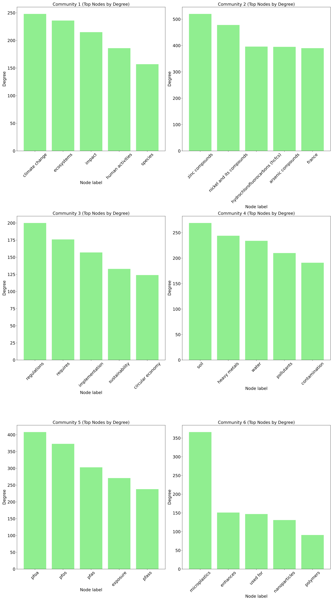

# LLM_Graph: An LLM-based Approach for Knowledge Graph Construction in the Environmental Science Domain


This repository provides an **LLM-based pipeline** for knowledge graph construction in the **environmental pollution** domain.  
It is inspired by the excellent work in [GraphReasoning](https://github.com/lamm-mit/GraphReasoning), and adapted to incorporate **graph-based mappings**, **centrality analysis**, **community detection**, and **competency-question answering** using both scientific text corpora and structured triples.

The pipeline addresses three major challenges in knowledge graph research:
- 🌍 **Conceptual divergence at literal level** across domains 
- 📄 **Extraction of structured knowledge** from unstructured environmental reports
- 📈 **Scalability** when integrating heterogeneous data such as industrial emissions, pollutants, and policies

Leveraging **Large Language Models** (Mistral and Zephyr), the pipeline extracts semantic triples, aligns similar entities via embedding-based similarity, and constructs a unified, queryable graph.  
Subsequent analysis demonstrates how this graph structure can model real-world environmental dynamics and support LLM-driven reasoning on interdisciplinary queries.

---

## System Requirement

> **This pipeline must be run on a Linux-based system.**  
> The `cuGraph` library (part of the RAPIDS ecosystem) does not support Windows and requires a Linux environment with an NVIDIA GPU and compatible CUDA drivers (≥12.0 recommended).

---

## Installation
After cloning the repository, follow these steps to set up the environment:

1. **Create Conda Environment**
   ```bash
   conda env create -f LLM_Graph/environment.yml
   ```

2. **Manually Install PyTorch with CUDA (recommended CUDA ≥ 12.4)**  
   Example:
   ```bash
   pip install torch --index-url https://download.pytorch.org/whl/cu124
   ```

3. **Install the project in editable mode**
   ```bash
   pip install -e LLM_Graph
   ```

4. **Download spaCy model**
   ```bash
   python -m spacy download en_core_web_sm
   ```

---

## Setup

- **Text Corpus**  
  The default corpus is under the `corpus_text_json/` directory. You can add additional text corpus **as long as they are chunked** properly.

- **Processing Raw Text**  
  To convert plain `.txt` files into chunked `.jsonl`, run:
  ```bash
  python rawtext_process.py --files example.txt,example2.txt,example3.txt --output_file example.jsonl
  ```

- **API Key Configuration**  
  update a `.env` file in the root directory to store:
  ```
  OPENAI_API_KEY=your_openai_key
  ENTREZ_EMAIL=your_email_for_ncbi_access
  ```

---

## Graph Construction

To build the knowledge graph and perform data mapping on the graph, including pmc text collection process, run:

```bash
python graph_construction.py --verbose False
```

The following outputs will be created:
- `final_mapped_cleaned_graph.graphml`: the main knowledge graph file
- `node_mapping.json`: mapping of node labels
- `label_mapping.json`: merged label dictionary
Processed triples from each corpus chunk files will be stored in `triples/` directory, and the final triples will be combined and saved in `all_triples.jsonl`.
However, this process does not include text collections from other sources such as textbook. Therefore, you need to upload these and use rawtext_process.py to conver them into chunks manually.
---

## Graph Analysis

Analysis is demonstrated in the notebook: `GraphAnalysis.ipynb`.  
It includes:

### Subgraph Generation  
📎 Image:  


---

### Centrality Analysis  
📎 Image:  


---

### Community Analysis  
📎 Images:
- 
- 

---

##  Citation / Reference

This work builds upon:
- [GraphReasoning by LAMM-MIT](https://github.com/lamm-mit/GraphReasoning)

---

